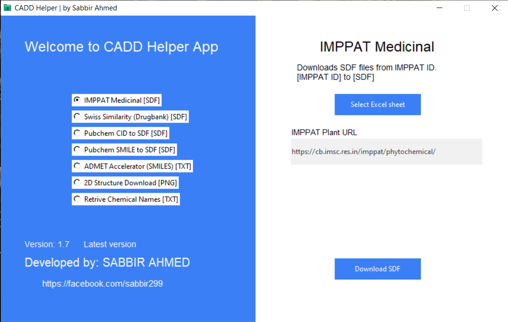

# CADD-Helper
The CADD-Helper is designed to facilitate the download of 3D SDF drug files for computer-aided drug design. Also it can accelerate ADMET analysis process of SwissADME and pkcsm. The app is user-friendly and enables efficient & accurate downloads for drug design research.

## Features

- SDF Download by ID (IMPPAT, SwissSimilarity, PubChem)
- SDF Download by SMILES (PubChem)
- ADMET accelerator by PubChem ID (SwissADME, pkcsm)
- 2D Structure png download by ID (IMPPAT, DrugBank, PubChem)
- Retrieve Chemical name by PubChem ID



## Installation
Download via cmd. Copy the code, paste it on CMD and hit enter. It will be download in Desktop.

```
cd Desktop & curl -OL https://github.com/sabbir-21/SDF-Protein-CADD/releases/download/v1.7/CADD_Helper_v1.7.exe
```
Or

Download from [Releases](https://github.com/sabbir-21/SDF-Protein-CADD/releases/latest)

[](https://github.com/sabbir-21/SDF-Protein-CADD/releases/latest)

[](https://github.com/sabbir-21/SDF-Protein-CADD/releases) [](https://github.com/sabbir-21/SDF-Protein-CADD/releases) 

- Its a portable Application. No need to install it. Just double click to run.
- This application is not free for all. You need to purchase it from me. Purchase licence key from [Buy Now](https://sabbir-21.github.io/portfolio/buy.html)


## Usage
Application startup time is around 5-15 seconds varying on your computer.
- Enter licence key to activate it lifetime.
- Choose `Option` from left side.
- Select excel sheet by pressing `Select Excel Sheet ` button. Excel sheet should contain `IMPPAT ID` or `Drugbank ID` or `Pubchem CID`.
- For swiss similarity, you need to convert CSV first by clicking `CSV` button. CSV will be converted to Excel file named `csvToExcel.xlsx`. Then you will select that excel file.
- You may need to specify `Sheet Name`. By default sheet name will be provided as the file is selected.
- You may need to enter `Column Name` which contains the ID. By default required value will be provided.
- Press the `Download SDF` or `Write SMILES` button. Download progress will be shown to the top of the button. After completing the task, `Completed` text will be shown.

## Demo Screenshot of Excel


## Problems

1. App can't be opened offline. App is fully based on Online. Internet connection problem may `crash` the app. `Re-Opening the app may solve the problem`
2. Windows defender detects the app as malware. So you have to turn off windows defender while downloading the app. See details [here ](https://stackoverflow.com/questions/43777106/program-made-with-pyinstaller-now-seen-as-a-trojan-horse-by-avg) why this happens.
`Downloading with CMD may solve the problem.`

## Language
Built with  [](https://www.python.org/)

## License
© Sabbir Ahmed

**Paid Software, Yeah!**
.